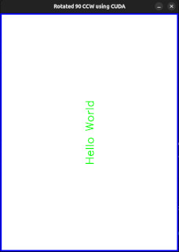

# OpenCV + CUDA Docker Development Environment

A Docker-based C++ development environment with OpenCV (latest) and CUDA 13.0 support on Ubuntu 24.04. Includes GPU-accelerated computer vision, X11 display forwarding, and a simple build system via `make`.

## Features

- **Base image**: `nvidia/cuda:13.0.2-cudnn-devel-ubuntu24.04`
- **OpenCV**: Built from source with full CUDA/cuDNN acceleration
- **CUDA Compute**: Configured for `sm_89` (RTX 40-series); easy to adjust
- **C++23** compilation via `g++`
- **X11 forwarding** for GUI windows (`cv::imshow`, etc.)
- **Volume mount**: host project directory mounted at `/app` inside the container
- **FFmpeg / GStreamer / V4L2** codec support included

## Requirements

| Requirement | Notes |
|---|---|
| NVIDIA GPU | Compute capability ≥ 8.9 (or adjust `CUDA_ARCH_BIN` in Dockerfile) |
| NVIDIA driver | Compatible with CUDA 13.0 |
| [Docker Engine](https://docs.docker.com/engine/install/) | 20.10+ |
| [NVIDIA Container Toolkit](https://docs.nvidia.com/datacenter/cloud-native/container-toolkit/install-guide.html) | Enables `--gpus all` |
| 16 GB free disk space | OpenCV source build is large |
| 8 GB RAM | Recommended for parallel compilation |

## Project Structure

```
.
├── Dockerfile                  # Multi-layer image: CUDA base → deps → OpenCV build
├── docker-build.sh             # Build the Docker image
├── docker-run.sh               # Run container with GPU, X11, and volume mount
├── docker-clean.sh             # Remove the built Docker image
├── Makefile                    # Compile & run the test program inside the container
├── img/                        # Screenshots
│   └── sshot.jpg               # Screenshot of the running application
├── src/                        # Source code folder
│   └── test_opencv_cuda.cpp    # Sample program: draws text on an image, rotates using CUDA and shows on screen
└── build/                      # Compilation output (created by make)
    └── test_opencv_cuda        # Compiled binary
```

## Screenshot



## Quick Start

### 1. Build the Docker image

> ⚠️ This step compiles OpenCV from source and **takes 20–60 minutes** depending on your hardware.

```bash
./docker-build.sh
```

This builds and tags the Docker image as `opencv-cuda-13.02-dev`.

### 2. Start a development container shell 

```bash
./docker-run.sh
```

This drops you into an interactive shell inside the container with:
- GPU access (`--gpus all`)
- Your project directory mounted at `/app`
- X11 display forwarding (for `cv::imshow`)

### 3. Build and run the sample program

Inside the container:

```bash
make        # compiles test_opencv_cuda.cpp → build/test_opencv_cuda
make run    # runs build/test_opencv_cuda (creates build/foo.jpg)
make clean  # removes build artifacts
```

The sample program:
1. Creates a 640×480 white image with a blue border and centered green "Hello World" text (CPU)
2. Uploads the image to the GPU (`cv::cuda::GpuMat`)
3. Rotates it **90° counter-clockwise** using `cv::cuda::rotate()` — this confirms CUDA is working
4. Downloads the result back to CPU
5. Saves `build/foo_rotated.jpg` (rotated)
6. Displays finale image on host via X11

### 4. Clean up

To remove the Docker image when no longer needed:

```bash
./docker-clean.sh
```
## Makefile Reference

| Target | Description |
|---|---|
| `make` / `make all` | Compile `test_opencv_cuda.cpp` into `build/test_opencv_cuda` |
| `make run` | Run the compiled binary |
| `make clean` | Delete everything in `build/` |

Compilation uses C++23 (`-std=c++23 -O2`) and links against OpenCV 4 (via `pkg-config`) and CUDA runtime.

